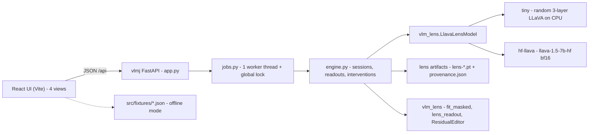

# VLM J-Lens MVP1 — interactive readout, attribution, knockout and steering (LLaVA-1.5-7B)

Local, single-user research tool for **captioning hallucination** in `llava-hf/llava-1.5-7b-hf`:
J-Lens readouts over image patches and generated tokens, per-patch attribution, causal patch
knockout through the multimodal projector, and interactive residual-stream steering. Status:
**MVP1 implemented** in this fork under `apps/vlm-jlens-demo/`. Technique claims are licensed by
[`vlm-viz-research.md`](vlm-viz-research.md) (sections cited as `§n`; per-view engineering
defaults as `§5 V1..V6`; `[A ...]` ids are that document's in-repo anchors). MVP1 vendors no
upstream Neuronpedia code.

## 1. Purpose & scope

**In scope**

- One session = one image + one prompt + one greedy caption; every intervention reports the
  caption it produced (`§5 V1`, `§5 V4`).
- Four views: Session, Caption & lens, Patch attribution, Knockout & steering.
- Lens readout for `gen` / `prompt` / `patch` targets; per-patch `lens_prob` / `lens_logit`
  attribution plus an `attn_rollout` comparison metric; projector-level patch knockout (`zero` /
  `mean`); `add` / `ablate` / `swap` steering in lens coordinates.
- Text-only twin sessions (`variant: "no_image"`) as a language-prior baseline (`§2.1`).
- Three operating modes (§4) so the UI is developable on an 8 GB laptop with no GPU.

**Out of scope (deferred, not stubbed)**

- The V5 attention-rollout *overlay view*: MVP1 ships rollout only as an attribution metric,
  not as an overlay; no per-head galleries (`§4.6`), no POPE/CHAIR harness, no tuned lens.
- Embedding into the upstream webapp (option B, §7) and remote or multi-user serving.

**SAE dashboards are untouched.** No file under `apps/webapp/app/sae-bench/`,
`apps/webapp/components/` or any existing `apps/*` service changed for MVP1; the change set is
additive: `apps/vlm-jlens-demo/` plus `docs/`.

## 2. System architecture



| Component | Path | Responsibility |
| --- | --- | --- |
| Backend app | `apps/vlm-jlens-demo/backend/vlmj/app.py` | FastAPI routes, error mapping, static mount of `../frontend/dist` when present |
| Engine | `.../vlmj/engine.py` | Model + one lens, session store, job bodies, projector knockout hook, rollout, steering diagnostics, tiny auto-fit |
| Job queue | `.../vlmj/jobs.py` | One `ThreadPoolExecutor(max_workers=1)`; `queued/running/done/error`, stage, progress; last 128 finished jobs kept |
| Schemas | `.../vlmj/schemas.py` | Pydantic request bodies; validation answers `422` before a job exists |
| Lens library | workspace `src/vlm_lens/` (+ vendored `jlens`) | `fit_masked`, `lens_readout`, `ResidualEditor`, `lens_vectors`, `LlavaLensModel` — imported unchanged |
| Mock lens script | `.../backend/scripts/make_mock_lens.py` | Random `lens-*.pt` sets (`tiny`, `llava-7b`) with a loud `provenance.json` note |
| Tests | `.../backend/tests/test_api_tiny.py` | CPU-only HTTP tests over the whole pipeline |
| Frontend | `.../frontend/src/` | `App.tsx` shell, `views/{Session,Caption,Patch,Steer}View.tsx`, `components/*`, `lib/{api,types,fixtures,colormap}.ts` |

Ports: the CLI defaults to `--port 8000`; the Vite dev proxy targets `http://127.0.0.1:8787`
(`frontend/vite.config.ts`), so local dev starts the backend with `--port 8787`. In production the
backend serves the built `dist/` itself, keeping `/api` same-origin.

## 3. Frozen HTTP contract

All bodies JSON, `snake_case`, errors `{"detail": "..."}`. The backend README
(`apps/vlm-jlens-demo/backend/README.md`) is the canonical field-level reference;
`frontend/src/lib/types.ts` mirrors it.

| Method | Path | Body (summary) | Result |
| --- | --- | --- | --- |
| GET | `/api/meta` | – | mode/device/dtype, model geometry, lens state (`available/masks/n_prompts/mock/notes/error`), capabilities, job counts, free VRAM |
| GET | `/api/samples` | – | three deterministic synthetic PNGs as data URLs |
| POST | `/api/session` | `image_b64` or `image_path`, optional `prompt`, optional `variant` (`image`\|`no_image`) | session (synchronous); `image` is `null` for the twin |
| GET | `/api/session/{id}` | – | `variant`, `has_baseline`, cached `baseline_caption`, lens state |
| POST | `/api/generate` | `session_id`, `max_new_tokens` (1..64) | job → caption + tokens with logprobs; caches the baseline |
| POST | `/api/lens` | `session_id`, `layers?`, `targets[]` (`gen`\|`prompt`\|`patch`), `topk?`, `track?` | job → per-target per-layer top-k, tracked tokens, `model_row` |
| POST | `/api/attribution` | `session_id`, `layer`, `token?`, `metric?` (`lens_prob`\|`lens_logit`\|`attn_rollout`), `rollout?` | job → 24×24 `grid`, `grid_rank`, `quarters`, `vmin`/`vmax` |
| POST | `/api/knockout` | `session_id`, `patches[]`, `mode?` (`zero`\|`mean`), `target_tokens?`, `max_new_tokens?` | job → baseline/after captions, teacher-forced Δlogprob, `outcomes` |
| POST | `/api/steer` | `session_id`, `layer`, `mode` (`add`\|`ablate`\|`swap`), `token?`, `source_token?`, `alpha`, `positions?` (`last`\|`all`), `max_new_tokens?` | job → before/after captions, `edits`, `diagnostics` |
| GET | `/api/jobs/{id}` | – | `{job_id, kind, status, stage, progress, t_submit, t_start, t_end, error, result}` |

**Async job protocol.** Every expensive call is a job: `POST` returns `{job_id}` immediately and
the client polls `/api/jobs/{id}` at ~700 ms. `status` ∈ `queued → running → done | error`;
`stage` is a human string (`forward`, `transport`, `scoring patches`, `generating 7/24`, …) and
`progress` is 0..1. One job runs at a time (single worker + one global model lock), so a burst of
clicks queues instead of racing. Request validation (`422`) happens *before* a job is created;
failures *inside* a job surface as `status: "error"` with `error: "<ExcType>: <message>"`, not as
an HTTP status.

**Conventions the UI relies on.** `image: {start, end, count}` uses absolute `input_ids`
positions with an exclusive `end`; `quarter_of_patch[576]` is row-major (0=top-left … 3=bottom-
right). Lens ranks are **1-based** (rank 1 = the token the lens scores highest); `track` echoes
the requested strings. `no_image` sessions strip the literal `<image>` from the prompt;
`/api/generate` and `/api/steer` work on them while `/api/attribution` and `/api/knockout` answer
`409` because no patches exist. `max_new_tokens` is capped at 64
(`/api/meta.capabilities.max_new_tokens`); at most 64 sessions are retained.

**Error semantics.** `404` unknown session/job; `409` lens unavailable (every lens endpoint) and
patch endpoints on a `no_image` session; `422` validation (out-of-range position, unknown layer,
unknown token, `gen` target before any generation, bad enum); `503` model backend failed to load;
`500` only for rollout without a usable eager attention implementation.

**Additive research fields (MVP1, beyond a plain lens API).**

- `model_row` on every lens target: the model's own next-token distribution at that position —
  model output *by construction*, never lens evidence (`§5 V2`; claim hygiene in `§2`).
- `grid_rank[24][24]`: 1-based rank of the requested token in each patch's lens distribution
  (`null` for `attn_rollout`, which has no token distribution) (`§2.8`, `§4.4`).
- `outcomes[]` + `classification_note` on knockout: `removed` if `delta <= -1.0` and the token is
  absent from the regenerated caption, `persisted` if `|delta| < 0.2` and it is present there,
  else `changed` (`§2.7`, `§5 V4`).
- `diagnostics[]` on steer: `v_norm` (‖v_t‖ of the target direction), `h_norm` (baseline residual
  norm), `cond` (`torch.linalg.cond` of the `[v_s, v_t]` swap basis, else `null`; `> 1e3` means
  the pseudo-inverse edit is unstable) (`§5 V6`, `[A X7]`).
- Session `variant` + twin-capable `lens`/`generate` for the prior-gap comparison (`§2.1`).
- `meta.lens.{mock,notes,n_prompts}` so the UI can flag numerically meaningless lenses.

## 4. Data & model modes

| Mode | How | What it is | Research use |
| --- | --- | --- | --- |
| `tiny` auto-fit (default) | `VLMJ_BACKEND=tiny`, `VLMJ_AUTOFIT=1` | Real fit on 3 synthetic dummy images against a randomly initialised 3-layer LLaVA (`d_model=16`, `vocab=64`, real 336/14 grid = 576 image tokens; masks `text/image/all`; layers `[0,1]`), cached in `vlmj/.cache/tiny-lens` | UI work and contract tests only; ranks/probabilities are meaningless (`meta.lens.notes`) |
| Mock lens | `python scripts/make_mock_lens.py --preset tiny\|llava-7b --out DIR`, then `VLMJ_LENS_DIR=DIR` | Random `lens-*.pt` with `provenance.extra.mock=true` → `/api/meta.lens.mock`, UI `MOCK LENS` chip | Bring up the 7B UI before a fit lands; never cite numbers |
| `hf-llava` + real artifacts | `VLMJ_BACKEND=hf-llava VLMJ_MODEL=... VLMJ_LENS_DIR=/path/to/lens-set` | `llava-hf/llava-1.5-7b-hf` bf16 on CUDA against a trained lens set (`lens-{text,image,all}.pt` + `provenance.json`, e.g. from a `vlm_lens` fit) | The only research-grade mode |

**Partial campaign checkpoints are enough.** A directory may contain any subset of masks: the
engine loads exactly one per process, preferring `text` → `all` → `image`, so a campaign that has
finished only the text lens already works. `meta.lens.masks` lists what the set contains;
`n_prompts` comes from the sidecar provenance.

**No hard crash on a missing or broken lens** (enforced in `engine.py::_load_lens`):

1. An explicit `VLMJ_LENS_DIR` always wins over auto-fit — including when it is empty or corrupt.
2. Any load failure is caught; `/api/meta` reports `lens.available=false`, the attempted `dir` and
   the error string, and every lens endpoint answers `409` with that reason.
3. `/api/session` and `/api/generate` keep working without a lens (captioning/watch-only use).
4. Artifacts are validated before adoption: `d_model` must equal the model's and every source
   layer must be `< n_layers`; steering is restricted to the lens's fitted layers while
   attribution may also read the vanilla final layer.
5. A model that fails to load degrades `/api/meta` to a documented shape and answers `503`
   elsewhere — the UI shows a banner instead of a blank page.

## 5. VRAM & latency budget (one 24 GB-class card)

Budget for the 7B path, bf16 (`VLMJ_DTYPE=bf16`):

| Item | Size | Source |
| --- | --- | --- |
| Weights | ≈14.5 GB | bf16 7B checkpoint, backend README |
| Activations, 594-token prompt (576 image + 18 text) + ≤64 new tokens | ≈1–3 GB | backend README |
| KV cache (32 layers × 2 × 32 heads × 128 dim × ~658 tokens × 2 B) | ≈0.3 GB | arithmetic |
| `attn_rollout` eager-attention cache (32 layers × 32 heads × 594² × 2 B) | ≈0.7 GB | `§1` (same matrix) |
| CUDA context / fragmentation headroom | ≈1 GB | — |
| **Working set** | **≈17.5–19.5 GB → the ≤25 GB envelope** | — |

The lens itself stays in **host RAM** (≈2 GiB per 7B mask after the fp32 cast) and only one
`d_model × d_model` block (4096² × 2 B ≈ 34 MB) is copied to the GPU per readout, so it does not
compete with the weights. 4-bit loading is out of scope; `/api/meta.gpu` reports free/total VRAM
so the UI can warn.

**Single-worker rationale.** One 7B copy cannot be duplicated per request, the rollout metric
flips the model to eager attention (a model-wide toggle), and activation peaks are per-forward —
so the server runs one worker thread behind one global lock and serializes all model work.

**Latency ⇒ click-apply-wait, not live sliders.** A generation pass is 0.6–1.0 s per 12 tokens on
the campaign H100 (`§1`, `[A M10]`); a 24-token caption plus readouts is seconds-scale locally and
a patch sweep is not. Every control therefore submits a job and renders progress/stage, the alpha
slider is applied on a button press, and `alpha: 0` is the documented cheap end-to-end plumbing
check (it reproduces the baseline exactly). Tiny mode is sub-second and CPU-only, which keeps the
test suite and UI development fast.

## 6. UI/UX decisions per view

Tags: `[PROVEN STANDARD]` = established method (possibly a documented LLaVA adaptation);
`[ADAPTATION]` = the mechanistic claim is unvalidated on LLaVA (J-lens itself is `[ADAPTATION]`,
research-doc preamble).

**V1 Session** — sample picker or file upload, editable prompt with a visible `<image>`
placeholder, synchronous session creation then a generate job; the twin button creates the
`no_image` session reused by V2. *Decisions:* freeze the LLaVA chat template and greedy decoding
per session, and record the template in the session payload so cross-sample comparisons stay
valid — `[PROVEN STANDARD]` (`§5 V1`).

**V2 Caption & lens** — click a generated token → layers × top-k matrix, tracked-token
probability-vs-layer SVG chart, TSV export of flagged tokens. *Decisions:* the final layer and
`model_row` are labelled **"model output"** and never presented as lens evidence
(`[PROVEN STANDARD]`, `§5 V2`, `[A E2]`); cell shading defaults to **rank** when the matrix
compares layers, because rank separates real from hallucinated regions better than probability
(`[ADAPTATION]`, `§2.8`, `§4.4`); a mid-depth caveat is shown because held-out fidelity is
non-monotone (L10 beat L20, `§5 V2`, `[A M12]`).

**V3 Patch attribution** — 24×24 canvas heatmap over the session image with quarter outlines,
brush painting, `select top-64 by heat`, per-quarter mean chips, per-patch lens popover.
*Decisions:* the colour scale defaults to the **per-grid z-score** (shape of the attribution) with
a `raw` toggle (`[ADAPTATION]` presentation default, `§5 V3`); quarters are reported **per ordered
quarter** (row-major q0..q3), never averaged as if patches were exchangeable, because causal
masking makes patch order semantically load-bearing (`[ADAPTATION]`, `§2.5`, `[A F8]`); the hover
tooltip carries the 1-based `grid_rank` beside the score (`[ADAPTATION]`, `§2.8`, `§4.4`);
`attn_rollout` is an explicitly labelled comparison metric, never the default
`[PROVEN STANDARD]` method, `§1`, `§4.1`). MVP1 rollout applies the `§5 V5`
`0.5·A + 0.5·I` residual mixing per layer (Abnar & Zuidema) and supports only the step-0 query.

**V4 Knockout & steering** — paint patches in V3, then ablate them (`zero`/`mean`) and inspect
per-token teacher-forced Δlogprob bars plus the regenerated caption. *Decisions:* always
regenerate — post-edit lens readouts are the linear model's prediction, not causal evidence
(`[PROVEN STANDARD]`, `§5 V4`, `[A E4]`); freeze the metric and corruption protocol (baseline
caption, greedy decode, teacher forcing) and expose the zero/mean variants
(`[PROVEN STANDARD]`, `§1` activation-patching practice); classify each baseline token as
removed / persisted / changed to separate the two hallucination mechanisms (`[ADAPTATION]`,
`§2.7`).

**V6 Steering** — `add` / `ablate` / `swap` at a chosen fitted layer, residual-relative α presets
`{0.5, 1, 2, 3}`, positions `last`/`all`, before/after caption diff, per-edit diagnostics table.
*Decisions:* residual-relative α instead of an absolute coefficient (`[ADAPTATION]`, `§5 V6`,
`[A E5]`); show `v_norm`, `h_norm` and `cond`, and badge `cond > 1e3` swaps as unstable
(`[ADAPTATION]`, `§5 V6`, `[A X7]`); `alpha: 0` as the plumbing check. The direction is the
readout gradient `v_t = W_U[t] · J_l` (`§5 V6`, `[A F15]`).

**Twin / prior-gap (in V2)** — the `no_image` session runs the same prompt without the image
block; the two last-layer lens distributions are shown side by side as a
`[ADAPTATION] prior-gap proxy` (`§2.1`, text inertia). It is a proxy, not a causal readout: Δ > 0
means a token's last-layer lens mass is larger without the image, i.e. the text prior carries it.

## 7. Neuronpedia integration path

**Option A — standalone app in this fork (CHOSEN).** MVP1 lives at
`apps/vlm-jlens-demo/{backend,frontend}` behind its own frozen HTTP contract. Rationale: it runs
and is testable *today* on an 8 GB, GPU-less laptop (tiny + fixtures) and on the campaign box only
when the GPU is free; it needs nothing from the upstream stack (no Postgres, Prisma migrations,
next-auth, ~1–1.5 GB webapp `node_modules`, no CUDA/vLLM inference venv); and the contract is
stable enough that option B can adopt it unchanged.

**Option B — embed in the upstream webapp (documented path, not executed).** Six wiring steps
against the fork's extension points:

1. New Python service `apps/vlmjlens/` (mirroring `apps/inference/`: `pyproject.toml`, `Makefile`,
   `tests/`, and a committed `openapi.json` generated via the `make <app>-openapi` target)
   implementing the §3 contract.
2. Register it as a ComputeHost:
   `make host-add SERVICE=VLMJLENS MODEL=llava-1.5-7b URL=... SOURCES=...` (`Makefile:118`; the
   target requires `SERVICE`, `MODEL` and `URL`); the webapp resolves the row through
   `apps/webapp/lib/db/compute-host.ts`.
3. Add per-endpoint webapp routes `apps/webapp/app/api/vlmjlens/...`, each wrapped in
   `apps/webapp/lib/with-user.ts` — `withOptionalUser` for read-only research endpoints,
   `withAuthedUser` for the GPU-heavy jobs — forwarding to the ComputeHost URL.
4. Add the page `apps/webapp/app/[modelId]/vlmjlens/page.tsx` plus a sibling
   `vlmjlens-client.tsx`, following `apps/webapp/app/[modelId]/jlens/page.tsx`.
5. Port the four views onto upstream primitives (mapping table below).
6. Declare every adapted upstream file in the PR per `CONTRIBUTING.md` so `NOTICE` is updated;
   depend on the vendored J-lens copy at
   `utils/neuronpedia-utils/neuronpedia_utils/jlens/` instead of duplicating it.

**Mapping (ours → upstream).**

| Ours | Upstream reuse | Note |
| --- | --- | --- |
| `views/PatchView.tsx` canvas heatmap | `apps/webapp/app/[modelId]/graph/link-graph.tsx` | Pattern only: 5 stacked canvases + pointer hit-testing, adapted to image patches |
| `components/HeatmapGrid.tsx` | — | Hand-rolled `<canvas>` over the image box |
| `components/TopKTable.tsx` | `apps/webapp/app/sae-bench/evals-table.tsx` | PrimeReact DataTable with `virtualScrollerOptions: { itemSize: 36 }` |
| `components/LayerChart.tsx` (SVG) | `apps/webapp/app/sae-bench/evals-plot.tsx`, `apps/webapp/app/graph/info/plots.tsx` | Plotly (`react-plotly.js`) is the upstream chart stack |
| Tooltips | `apps/webapp/components/custom-tooltip.tsx` | — |
| `components/JobProgress.tsx` (poll) | `apps/webapp/components/provider/import-provider.tsx` (SSE `EventSource`) | Upstream streams long work inline (NDJSON client `apps/webapp/lib/utils/lens.ts` + `apps/webapp/components/jlens/jlens-stream.ts`) instead of polling a job queue |
| `views/SteerView.tsx` | `apps/webapp/components/steer/*`, `apps/webapp/app/steer`, `apps/webapp/app/api/steer/route.tsx` | Upstream steering is text-only |
| `lib/api.ts` API client | `apps/webapp/lib/utils/lens.ts` | Shared NDJSON stream types for `/v1/lens/prompt` |

**License / NOTICE.** The fork is Apache-2.0 (`LICENSE`, plus legacy `LICENSE-MIT`) and its
`NOTICE` already covers the vendored `jlens` (from `github.com/anthropics/jacobian-lens`) at
`utils/neuronpedia-utils/neuronpedia_utils/jlens/`; `CONTRIBUTING.md` requires declaring
third-party code so `NOTICE` can be updated. MVP1 copies no upstream code, so nothing must be
added today; any future port from the components above must be declared and attributed, while the
workspace's own lens code (`vlm_lens` + `third_party/jacobian-lens`) stays under the umbrella
repo's notices.

**Upstream is text-only.** `apps/inference/neuronpedia_inference/server.py` sets
`hf_overrides={"is_mm_prefix_lm": False}` with a comment that no endpoint accepts an image, and
`np_model_to_hf.json` maps text-only model ids to HF repos. Its existing lens surface
(`apps/inference/neuronpedia_inference/endpoints/lens/{prompt.py,lens_loader.py,residual_spec.py}`
serving `/v1/lens/prompt`, with webapp `components/jlens/*` and `lib/utils/lens.ts` NDJSON
streaming, plus text-only steering in `components/steer/*` + `app/steer` + `app/api/steer/route.tsx`)
is first-class for text models, but the harness cannot be configured into a multimodal one: option
B needs the genuinely new service from step 1.

## 8. Decision register

| # | Decision | Rationale / consequence |
| --- | --- | --- |
| D1 | **Standalone app** under `apps/vlm-jlens-demo/` (option A), not a webapp route | Runs on the 8 GB/no-GPU laptop today with zero upstream dependencies (no Postgres/Prisma/auth/webapp install); the frozen contract is what option B would import later |
| D2 | **Three lens modes** (tiny auto-fit, mock generator, `hf-llava` + real artifacts) with **fail-soft loading** | The UI must be developable without a GPU or a finished fit; a broken/missing lens yields `available: false` + `409`, never a boot crash; partial campaign checkpoints work because one mask is loaded |
| D3 | **Single-worker job queue** + global model lock | One 7B copy per process; eager-attention rollout is model-wide; correctness over concurrency. Cost: requests queue, so the UI must show stages |
| D4 | **Research-driven UI defaults are part of the contract** (rank-first shading, z-score scale, ordered-quarter aggregation, `model_row` labelled "model output", knockout outcome classes, steering diagnostics) | The defaults are frozen in §3/§6 so views cannot silently drift from the research doc's engineering readout |
| D5 | **No new frontend dependencies** — hand-rolled canvas and SVG | Production deps are `react` + `react-dom` only; keeps the demo installable/offline and avoids a chart library for two charts (`§3` lists CircuitsVis as reusable, unnecessary here) |
| D6 | **Fixtures mode** (`?fixtures=1` / `VITE_FIXTURES=1`) | Full offline UI exploration with the same job lifecycle (~700 ms poll) and fixtures mirroring the contract field-for-field, including a `cond > 1e3` swap for the warning badge |
| D7 | **Immutable upstream dirs**: nothing under `apps/webapp`, `apps/inference` or `utils/` changed | MVP1 is additive; upstream SAE/steering surfaces keep working exactly as before, and option B can be reviewed as a separate change |
| D8 | **Deployment: one GPU, never co-running with the fit campaign** | The demo needs ≈17.5–19.5 GB; the campaign's launcher guards free VRAM (≥24 GiB) and a co-tenant OOM-ed a fit leg (umbrella-workspace report `../../results/validation_2026-10-01/REPORT.md`). Start the 7B demo only when the GPU is free; use tiny/fixtures elsewhere |

## 9. Hallucination research roadmap enabled by the tool

- **Two-mechanism triage.** Knockout classes (`§2.7`): `removed` screens visual-uncertainty
  hallucinations (masking the region kills the token), `persisted` screens contextual-prior ones,
  `changed` catches drift to a different caption. The twin Δ then separates the cases further
  (`§2.1`).
- **Prior-gap quantification.** The `no_image` twin plus the `model_row` anchor give the
  text-inertia comparison per token (`§2.1`); the steering view adds the prior-suppression α
  preset for the persisted class (`§2.7`).
- **Cheap scoring harness.** Regenerated captions under mask/steer conditions are the causal
  readout (`§5 V4`); feeding them into POPE-style binary polls or CHAIR-style caption scoring is
  the natural next harness (`§1`, POPE/CHAIR rows) — the tool already emits the caption plus the
  condition spec, so the harness only needs a scorer.
- **Rank and position structure.** Rank-first shading and `grid_rank` test representation-level
  grounding confidence (`§2.8`); ordered-quarter aggregation and the causal patch-order caveat
  (`§2.5`, `[A F8]`) make quarter-level claims honest.
- **Deferred but specified.** V5 rollout overlay view (the metric itself ships with the
  `0.5·A + 0.5·I` mixing) and V4-linked
  cheap multi-token steering (`§1`), tuned-lens calibration for early layers (`§1`), and any
  SAE-dashboard cross-link (upstream) — all out of MVP1 scope.

## 10. Reproduction

```bash
# 1) UI only — no backend, deterministic fixtures
cd apps/vlm-jlens-demo/frontend && npm install && npm run dev    # http://localhost:5173/?fixtures=1

# 2) Local tiny stack — CPU, offline, real (if meaningless) lens
cd apps/vlm-jlens-demo/backend
~/miniforge3/envs/vlm-lens/bin/python -m vlmj.app --port 8787    # matches the Vite proxy
# then, in another shell: cd ../frontend && npm run dev          # http://localhost:5173

# or build once and let the backend serve it (same-origin, no proxy); run from the repo root
(cd apps/vlm-jlens-demo/frontend && npm run build)
cd apps/vlm-jlens-demo/backend && ~/miniforge3/envs/vlm-lens/bin/python -m vlmj.app --port 8787

# 3) Server 7B — GPU free, real lens artifacts
cd apps/vlm-jlens-demo/backend
VLMJ_BACKEND=hf-llava VLMJ_MODEL=llava-hf/llava-1.5-7b-hf \
VLMJ_LENS_DIR=/data/lenses/llava-1.5-7b/text VLMJ_DEVICE=cuda VLMJ_DTYPE=bf16 \
~/miniforge3/envs/vlm-lens/bin/python -m vlmj.app --port 8787

# 4) Contract tests (CPU, network-free)
~/miniforge3/envs/vlm-lens/bin/python -m pytest tests/test_api_tiny.py -v

# 5) Live end-to-end smoke against a running server (any backend)
~/miniforge3/envs/vlm-lens/bin/python scripts/e2e_smoke.py
```

Component-level instructions (env vars, example `curl`s, mock-lens script) live in
`apps/vlm-jlens-demo/README.md`, `.../backend/README.md` and `.../frontend/README.md`.

## Verification (orchestrator pass, 2026-10-03)

All checks ran on this machine against the code as it stands after the rollout-mixing fix below;
commands are reproducible from `apps/vlm-jlens-demo/`.

| Check | Command | Result |
| --- | --- | --- |
| Backend contract tests | `python -m pytest` (tiny stack + missing-lens guard) | 19 passed in 10.9 s |
| Frontend build (typecheck + bundle) | `npm run build` | `✓ built in 11.73 s` (55 modules, `dist/` emitted) |
| HTTP end-to-end smoke | `python scripts/e2e_smoke.py` against a live `VLMJ_BACKEND=tiny` server | `E2E_PASS` — meta, session geometry, generate, lens readout, attribution (`lens_prob` + `attn_rollout`), knockout, steering, twin all exercised; α=0 steering is caption-identical; twin attribution answers `409` |
| Browser pass (headless Chromium, live tiny server) | all four views + `?fixtures=1` | Caption/lens view renders `gen[0] 't47'` with `model_row` rank #1; attribution heatmap renders and its quarter values match the API exactly (`0.0142/0.0145/0.0148/0.0150`); steering α=2 renders the diagnostics table (`v_norm 0.127`, `h_norm 0.079`) and the BEFORE/AFTER diff; `select top-64 by heat` → knockout run renders baseline/knocked-out captions; fixtures mode renders the fixture caption, FLAGS and NO-IMAGE TWIN panels |

Post-review code change: `VlmJEngine.attention_rollout_values` now applies the `§5 V5`
`0.5·A + 0.5·I` residual mixing per layer (it previously multiplied raw attention rows); the
table above was produced after that change and the backend suite was re-run against it.

Not covered here: the `hf-llava` GPU path (D8 — first server run with the GPU free), attention
rollout at non-zero `max_new_tokens` steps (step-0 query only, by design), and fixtures-mode job
latency (structure only was checked).

## Interactive-coverage addendum (2026-10-03, second pass)

A full browser pass (CDP-driven Chromium) exercised **every interactive control and every
rendered visualization** across live-tiny and fixtures modes; a source-grounded inventory was
used to enumerate them. Newly covered beyond the table above: sample thumbnails, file upload
(`input[type=file]`) → session → generate → caption, prompt edit + `reset template`,
`max_new_tokens`, footer/MetaBar counters + `refresh`, prompt-tokens disclosure, matrix
`tok-cell` selection, flag note → export text, `copy` → "copied", per-flag `remove`, layer
slider re-run on layer 1, patch-chip removal (64 → 63 → 62), knockout `max_new_tokens` +
"tokens after knockout" disclosure, swap with `source_token`, alpha presets, positions=all,
and the fixtures-only `cond > 1e3` **"nearly collinear pair - swap unstable"** badge
(diagnostics cond 2254.7) plus real `removed` outcome rows.

One real defect was found and fixed during the pass: `GET /api/samples` returns `image_b64` as
a **data URL**, while the frontend prepends `data:image/png;base64,` itself at every ``;
live sample thumbnails and the PatchView image therefore rendered broken (the canvas
overlay collapsed to the 68×16 alt-text box). Fix: `lib/api.ts` `getSamples` normalizes to raw
base64 (`stripDataUrlPrefix`), keeping the app-wide raw-base64 convention (uploads and fixtures
already used raw). Re-verified after rebuild: thumbnails 336×336, `.heat-img` single-prefix
`data:image/png;base64,…`, the full patch flow green, and a fresh load collects **zero console
errors** (`{"entries":[],"nextSeq":0,"dropped":0}`) in both modes.

Behaviour confirmed as intended (not defects): primary actions disable until their
prerequisites exist (`compute attribution` without a target token, `apply steering` swap
without `source_token`, `run knockout` without painted patches); the tiny fixture model rejects
1×1 images (`ValueError … doesn't match model (336*336)`) through the job-error UI; tab
switches unmount a view and discard its local state (session/flags/patch selection live in App
and survive); `serialize` is a job *stage* label, not a button; no keyboard shortcuts exist by
design.
